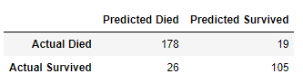
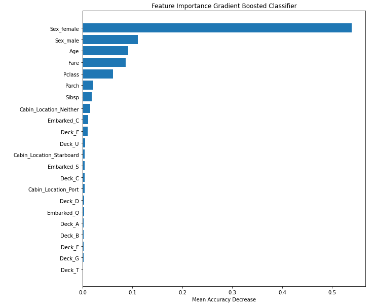

# Selected Topic

Titanic Passenger Survival...

[Google Slides](https://docs.google.com/presentation/d/1fPfQUhDatXaTUa1Yei5ws-fKyiqXjxEmRdNtDGr36yE/edit?usp=sharing)  
[Tableau Dashboard](https://public.tableau.com/app/profile/dan5194/viz/Titanic_Dashboard_16674008648990/Titanic_Dashboard)

Did the survival rate of the Titanic have anything to do with what class the passenger was in? Or was it the passengers age or maybe their sex that played a role in the survival rate? What if them having siblings or a spouse on board played a role?

The reason the group chose this question to answer is in April of 2012 the Titanic II was announced. The intended launch date was originally set to be 2016 but delayed to 2018 and push again until 2022. The project was resumed in November 2018 after a hiatus which began in 2015 cause by a financial dispute.

With the help of Kaggle the team was able to acquire multiple data sets, with information ranging from Passenger name's, sex, age all the way to if they had parents, siblings or a spouse on board. The data sets also include where the passenger embarked from with 3 options for the passengers - Southampton, Cherbourg and Queenstown.

Will the Titanic II ever set sail? Who knows, but if it does will the passengers face the same fate as the original?

# Visuals And Analysis
## Analysis Overview
-   The analysis for this project will be mostly be handled using Tableau visualization.  Data graphs and charts provided will help answer questions in regard to survival rate on the Titanic.
- Many different factors affected the outcome of passengers survival.  Manipulating the source data will allowed representation for the 1309 passenger survivors on the journey of the unsinkable ship. 
- Of the approx. 2200 passengers, roughly 900 are support staff and crew and the remaining 1309 are passengers.  Our data set will be strictly associated with the passengers on board, research in inquiry led us to find that not much readily accessible data was available for the 900 or so employees that lost their lives aboard the Titanic. 
- The overall survival rate for passengers…….37.7%
A mere 494 of 1309 passengers survived and rescued. 

After adjusting the number of weak learners and rate at which the models learn to optimize performance, our model had an accuracy score of 86.28%. This means it correctly identified 86.28% of the test values into survived or died. This is solid, but still leaves room for improvement. These improvement areas are to use a random forest model to look at feature importance, perform dimensionality reduction, and switch from the gradient boosted classifier model.

## Passenger Age
### Age Analysis
- What was the average age of the passengers aboard?
    - The average age of all the passengers in our database was approximately 29.88 years of age 
    - Using an average age of around 30 you can see that the most common gender would male that were in 2nd class
    - This is closely followed by females in the 2nd class as well.  

- Who was the oldest Passenger aboard the ship?
    - The oldest per recorded on the Titanic was 80 years of age and was a bit of an outlier, but not enough to skew any data as the age of passengers has a steady decline versus a dramatic downfall

- There were approximately 39 children under 3 recorded of which 21 survived for a rate of only 53.8%, a morbid stat but considering the conditions that they incurred is rather impressive.

- Increase age range to single digits (“All women and children only!”) with an age of 9 and under increase the survival rate a dismal amount to 54.9%.  45 of the 82.  

-   And the main group of passengers represented by treemap has  survival statistics for 10-54. 

## Passenger Class
### Class Analysis
- The average fare for first class varied greatly from 2nd and 3rd.  They were mostly located in decks “A” and “B”.  These were the only two levels above the main deck. There were 494 survivors in total

- The total number of 1st class passengers came in at 186 or 36.7% that survived

- 2nd class not much lower with 117 or 23.7% 

- 3rd class had a194 or 39.3%, the last 0.3% was represented in null values.

- 2nd class survival:
    - Unfortunately a lot of the cabin data was not found and or recorded from passengers that survived.  
    -   With a few bits data we could make a strong argument that 2nd class was mainly concentrated in the D, E, and F decks of the Titanic.  

## Passenger Gender
### Gender Analysis

- Which gender had the best survival rate?
    -   Females had a much better rate of survival over males with all 385:109, nearly 3.5x’s survival
    -   There was no significant class or location determinations when it came to loading the rescue boats according to the statistics

-   Consist with analysis already presented, another few visuals to help understand that class had no effect on the survival rate

-   Once again you can see that males in the 2nd class or middles decks of the ship had the worst chance of making it out with their lives

-   What gender had the highest average fare for each class?
    -   Interestingly enough Female from Cherbourg were the highest charges gender over males except for in Queenstown were the average was very similar

## Departure Locaions
### Cherbourg, France ; Queenstown, Ireland ; Southhampton, England 

-   There is a strong correlation in the data between the destination in which passengers got on board the Titanic and survival rate.  This is because of the fact that of the 1309 passengers, 914 of them boarded in England

-   Since nearly 70% of the passengers boarded from the same location, this could potentially skew any data that were to be analyzed with a starting point of departure locations 

# Dashboard

Dashboard will consist of: 
- Showing the findings of the machine learning algorithm
- Graphic of survival rate by class 
- Graphic of survival rate by sex 
- Graphic of survival rate by age

The main tool used to create the dashboard will be Tableau. The Tableau dashboard will have an assortment of interactive charts. 
Tableau is a data visualization tool that helps create interactive graphs and charts in the form of dashboards and worksheets to gain insights into a data source.

By using Tableau public our viewers will be able to interact with our analysis by using the Passenger Lookup. With the passenger lookup a user can select a name from the drop down to view if they survived or not what class they are and their age along with other measures. The viewrs will also be able to sort the list by Male or Female. Also the list can be filtered by just class to show who survived or not from a selected class. Finaly the list can be filterd by all the survivers.   

[Tableau Dashboard](https://public.tableau.com/app/profile/dan5194/viz/Titanic_Dashboard_16674008648990/Titanic_Dashboard)

# Machine Learning Model
## Overview
Can we create a machine learning model to predict what types of passengers survived the crash? Moreover, which characteristics of a passenger lead them to be saved. To answer this question, we will feature the characteristics about the titanic passengers in the model and target if they survived or not.

## Data Preprocessing
1. Our dataset has 12 columns with 1309 separate data points. 11 columns containing passenger information and 1 column determining their survival. 0 equating to not surviving and 1 equating to survival.
2. Name and Passenger ID are variables are not needed in a Machine Learning Model, so they are dropped. 
3. After checking the number of unique values, I noticed 929 of the 1309 values for ticket were unique, with no ticket occurring more than 11 times. The ticket column refers to the unique ID ticket that was bought. This has no relation to if the passenger survived. Therefore, ticket is not a helpful feature for our machine learning model, so it is dropped.
4. Next, I looked at the null values in our dataset. Due to the small size of our dataset, we will attempt to keep as many rows as possible and fill in any null values. The two major columns for null values are age and cabin. All null values for the cabin column will be filled with "u" for unknown. All age values will be filled in taking the average value of the two ages they are next to in the dataset.
5. The cabin column now has 187 unique values. Known cabin values are in the form A 46, where A is the deck and 46 is the room. All odd numbered cabins are on the starboard(right) side and all even numbered cabins are on the port(left) side. I broke cabin into two separate rows. The first column is Deck, which contains values A through G, T, and Unknown. This consists of 9 unique values. The second column is Cabin_Location. This column contains values of starboard, port, or neither. We finish by dropping cabin row as the Deck and Cabin_Location columns represent the same values.
6. Now that the name, ID, and ticket number are dropped, 87 out of our 1309 rows have duplicate values. This is due to two different people sharing the exact same characteristics. Since the dataset is small and they are different passengers, I decided to leave them in the dataset for the model. Usually duplicate values overfit, but that is not a concern due to the dataset size.
7. Lastly, the non-numeric values need to be converted into numeric values. To do so, I took all the non-numeric features and engineered “n” separate columns, where “n” is the number of unique values that exist in that column. The newly created columns will be either 0 or a 1. For example, the Sex column was originally “Male or Female”. It will turn into two new columns of Sex Male and Sex Female. If the original column had male as a result the Sex Male column will be 1 and the Sex Female column will be 0.
8. We finish our preprocessing with 23 columns and 1309 rows.

## Features and Targets
Features:
-	Passenger Class
-	Passenger Sex
-	Passenger Age
-	Number of Siblings Aboard
-	Number of Parents Aboard
-	Price of Ticket
-	Port of Embarkation
-   Deck Location
-   Cabin Location

Target:
-	Survived the shipwreck

## Training and Testing Model
The data will be randomly split into a training and a testing set. 75% of the data will be randomly selected to be in the training set. The we will use this data to train or fit the machine learning model. The remaining 25% of the data will be used to test the validity of our model.

The training and testing datasets are then scaled to the unit variance of the training set. This reduces the impact of outliers and standardizes the values across columns so that one column isn’t weighted more due to its values being larger.

## Description of Model
### Overview
The model we are using is a Gradient Boosted Classifier model. The boosting element is it uses a large number of weak learning models that each learn from each other to create a stronger learning model. The gradient aspect is each model learns from the errors of the previous. 

We choose this because it is a classifier model that can be highly accurate and can be tuned to increase performance. 

### Pros and Cons
Benefits of the model:
- Classifier model that is able to predict both numerical and categorical values.
- Training off of weakness makes the model highly accurate
- Has several hyperparameters such as learning rate and estimators that can be adjusted to increase performance

Downsides of the model:
- The model will keep trying to minimize errors and can emphasize outliers too much and overfit easily
- Complex "black box" model that can be computationally intense

### Results
After adjusting the number of weak learners and rate at which the models learn to optimize performance we were able to obtain the below results:

> Confusion Matrix

328 passengers make up the test data, since the testing data randomly selected 25% of the total data. The model was able to correctly predict 178 who actually died out of 204 and 105 who actually survived out of 124. This gives our model had an accuracy score of 86.28%, or 283 out of 328. It was able correctly identified 86.28% of the test values into survived or died.

So what characteristics of a passenger impacted our model the most? Below is a chart of each feature and how much on average it would decrease our accuracy score if omitted:

> Feature Importance

Our model was able to achieve a high level of accuracy by focusing on if the passenger was a female or not. If the passenger was a male or not, their age, how much their ticket was, and class also played a significant role. The number of siblings, parents, and where their cabin was located had little effect on the accuracy score of our model.

#   Summary
-   Age, Class and Gender were major factors in deciding who would have better chance of survival on the Titanic.  The location from which the passengers departed are less of a factor for analysis.  Using Machine Learning, Jupyter Notebook, PgAdmin, Postgres, Tableau and Google Slides we are to wrap up the data project

-   The well known “Women and children first!” was represented in the data and analysis  

-   Survival rates for older men were significantly low in comparison no matter what class in which the reside as depicted in many recreations, documentaries and resources 

-   Higher survival rates for ages up to between 10 and 54 as these make up the majority of the passengers on board the Titanic

## Prestentation 
[Google Slides](https://docs.google.com/presentation/d/1fPfQUhDatXaTUa1Yei5ws-fKyiqXjxEmRdNtDGr36yE/edit?usp=sharing)

